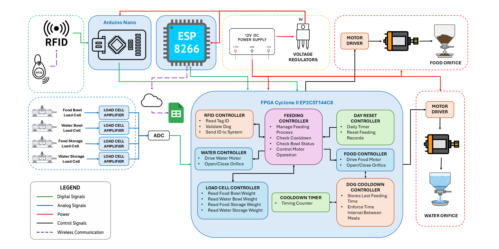

# FPGA-Based Food and Water Dispensing System for Dog Shelters

Verilog HDL | Intel Cyclone II FPGA | ModelSim Verification

An FPGA-based automated food and water dispensing system implemented in **Verilog HDL** with **simulation-based verification using ModelSim**.

---

## Project Highlights

- Designed **9 modular RTL modules** in Verilog HDL
- Developed **independent ModelSim testbenches** for every RTL module
- Implemented hierarchical FPGA architecture with FSM-based controllers
- Integrated RFID identification, load-cell monitoring, and motor control
- Verified the complete top-level system prior to FPGA deployment

---

## Overview

This project presents the design and implementation of an FPGA-based automated food and water dispensing system intended for use in dog shelters. The system identifies individual dogs using RFID technology, monitors food and water levels through load cells, and controls dispensing using DC motors. An IoT monitoring system records system data to Google Sheets, enabling remote monitoring of the dispensing process.

The hardware controller is implemented in Verilog HDL and deployed on an **Altera Cyclone II EP2C5T144I8N FPGA**.

---

## Features

### Feeding System
- RFID-based dog identification
- Automatic food dispensing
- Feeding cooldown mechanism
- Daily feeding reset

### Water System
- Automatic water dispensing
- Water level monitoring

### Monitoring
- IoT monitoring through Google Sheets

### FPGA Design
- Modular Verilog HDL architecture
- Hierarchical RTL design
- Functional verification using ModelSim

---

## System Architecture



---

## RTL Module Hierarchy

The project consists of **9 synchronous RTL modules** organized hierarchically.

```
FPGA_Dog_Feeder (Top Module)
│
├── feeding_controller
│   └── food_controller
│       └── dog_cooldown_controller
│           └── cooldown_timer
│   ├── water_controller
│   └── loadcell_controller
│
├── rfid_controller
│
└── day_reset_controller
```

---

## Hardware Components

| Component | Purpose |
|----------|---------|
| Altera Cyclone II EP2C5T144I8N | Main FPGA controller |
| RFID Reader & Tags | Dog identification |
| Load Cells | Food and water level measurement |
| DC Motors | Dispensing mechanism |
| IoT Module | Upload system data to Google Sheets |

---

## Verification

The design follows a module-by-module verification methodology.

Each RTL module has an independent ModelSim testbench to verify its functionality before system integration.

| RTL Module | Testbench | Status |
|------------|-----------|--------|
| cooldown_timer | cooldown_timer_tb | ✅ |
| dog_cooldown_controller | dog_cooldown_controller_tb | ✅ |
| rfid_controller | rfid_controller_tb | ✅ |
| loadcell_controller | loadcell_controller_tb | ✅ |
| water_controller | water_controller_tb | ✅ |
| food_controller | food_controller_tb | ✅ |
| feeding_controller | feeding_controller_tb | ✅ |
| day_reset_controller | day_reset_controller_tb | ✅ |
| FPGA_Dog_Feeder | FPGA_Dog_Feeder_tb | ✅ |

Representative simulation waveforms for each module are available in the **waveforms/** directory.

---

## Project Structure

```
FPGA-Dog-Feeder/
│
├── rtl/               # Verilog HDL source files
├── tb/                # ModelSim testbenches
├── waveforms/         # Simulation waveform screenshots
├── docs/              # Project documentation
└── README.md
```

---

## Development Tools

- Verilog HDL
- Intel Quartus Prime
- ModelSim
- Git & GitHub

---

## Results

The complete system was successfully:

- Simulated using ModelSim
- Verified through module-level and top-level integration testbenches
- Synthesized using Intel Quartus Prime
- Implemented on an Intel Cyclone II FPGA

---

## Skills Demonstrated

- Verilog HDL
- RTL Design
- Finite State Machine (FSM) Design
- Hierarchical FPGA Design
- Functional Verification
- ModelSim Simulation
- Intel Quartus Prime
- Hardware Debugging
- Embedded Systems Integration

---

## Repository Status

## Project Status

✅ Complete

The FPGA hardware and RTL design have been implemented, verified through dedicated ModelSim testbenches, and organized as a portfolio project demonstrating modular FPGA development and functional verification.

---

## License

This project is intended for educational, research, and portfolio purposes.
